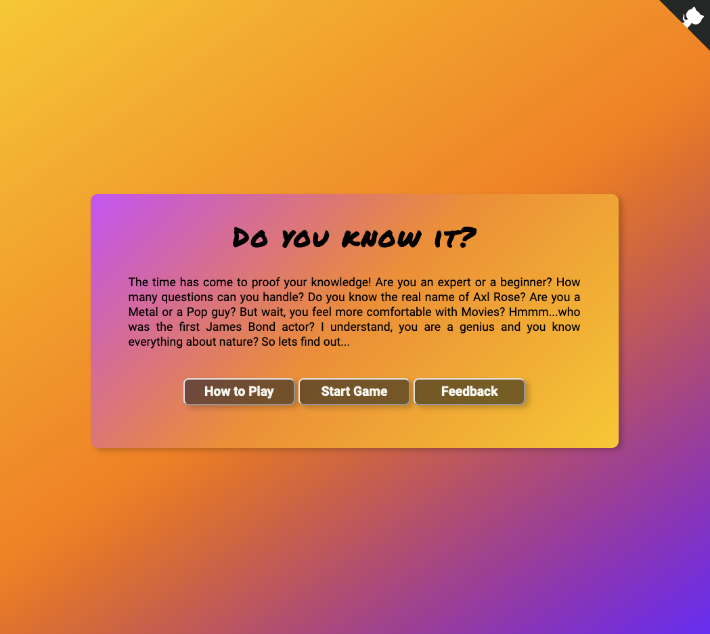
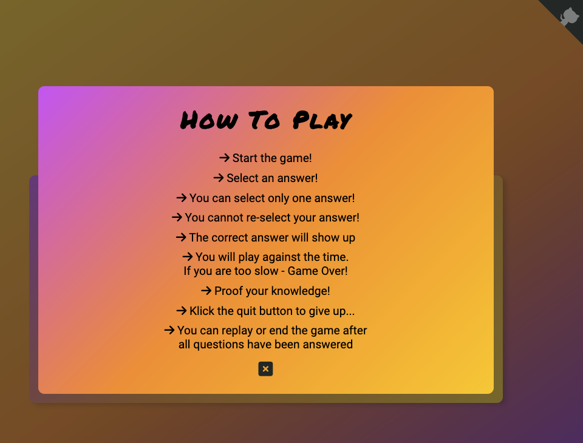
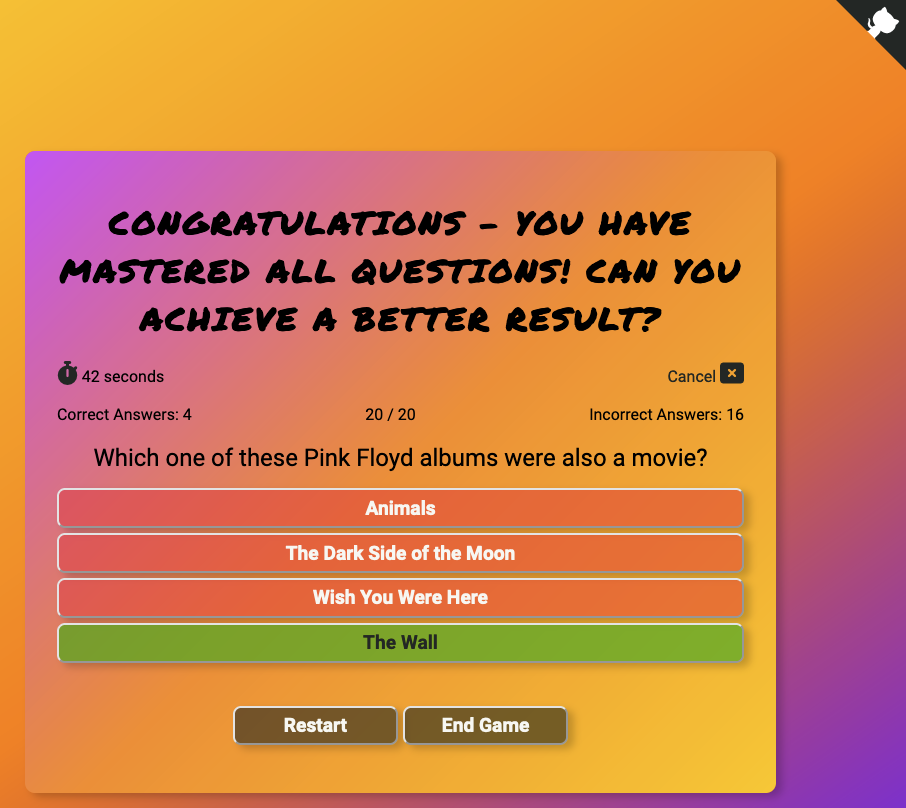
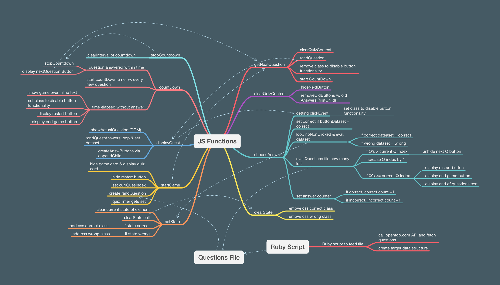

# Do You Know It?
The main purpose of this site is to provide a sleek and beautiful playground for the famous Trivia Quiz. It is a simple game, covering a few topics of the [Open Trivia Database](https://opentdb.com/).
The important goal is to have fun and get challenged by the questions.
    
Link to deployed site: [Do You Know It?](https://rpf13.github.io/Do-You-Know-It/)


---

## Objectives
This section covers the goals, which I had when doing this project. Not everything was clear form the beginning and it was difficult to estimate the technical effort, since I am new to this field. Therefore, the aim was the MVP with it's main functionality and put all other nice to have features into stretch objective.

### Main Objectives

My main objectives for this project (besides the below listed features) were, to get hands on JavaScript interaction with the DOM, but also to become more familiar with the basics of JS as well as trying to implement these features in my project.
I did also want to get more experiense with flexbox and trying to use css grid as well as getting to know modals.

- Using advanced color scheme with multiple colors
- Main site which uses flexbox / grid to arrange cards, buttons, nav
- Button to explain game using modals
- Start button, which displays the quiz
- Feedback button, which relates to a contact form
- Contact form with name, mail and feedback text. Submit button should trigger modal box with confirmation message and button to go back home
- Quiz card, which displays the question and gives a choice for the answer
- Cancel button brings user back to home
- Correct and Incorrect answers are counted and displayed
- The current state of questions gets displayed, showing at which question of the total the player currently is
- Github button / corner on the top right corner gets always displayed
- Sites are built mobile first and scale up for bigger screens

### Stretch Objectives

The following stretch objectivse are meant as a "nice to have" feature and depending on the time, I will implement them or not.

- Timer countdown to answer
- Script to fetch questions from API and format them into the target format, fill the Questions file with it
- Randomize the answer display order
- Add only a certain amount of questions out of the questions array, to the quiz
- Randomize the questions added to the quiz
- API call to fetch questions from opentdb - basically fully integrate the API with all related tasks like error handling, into the quiz. This objective would replace the stretch objective to generate a separate script to fetch questions.

## UX & Design
The main design is based on a colorful, sleek design. It is minimalistic but it contains all necessary elements to have fun.

This site has been built with the "mobile first" approach in mind. This results in a very responsive and easy to navigate site, independet of the medium, which is used to access it. The whole site scales down to devices with 250px width, hence completely responsive. 

### User Stories
- As a visiting user, I would like to be immediately attracted by a beautiful, colorful and minimalistic site
- As a visiting user, I would like to have an immediate overview of the site and how the quiz works
- As a visiting user, I can find an explanation on how to play the quiz
- As a visiting user, I can see the status of the running quiz, how many questions are left, how many correct and wrong answers
- As a visiting user, I always have the chance to abort the game and go back to the main site
- As a visiting user, I can fill out a contact form to give feedback
- As a visiting user, I can visit the github repo via dedicated link / button
- As a visiting user, I will get an end of game text, once I have finished all questions. From there I can replay the game or go back to the main site.

### Color Scheme
There are three different sets of colors. One set is used to create the various gradient effects, which result in the distinct and very beautiful background effect of every site and most of the cards. The second one is used for the background of the individual cards, which contain the actual content. I had to choose a different color set in order to achieve and pass the contrast test. It took quite some effort to find a suitable set, but the result looks great.
I did also play with the degree of mixing the colors in order to achieve the result of different effects. The base of the gradient effect are three colors, which are then mixed together.

<details>
<summary>Gradient Base Colors and Gradient Mix</summary>

 


</details>

<details>
<summary>Gradient Base Colors and Gradient Mix used for the cards</summary>

 


</details>

For the rest of the site, I have used the following colors, which are simple but build a nice and clear contrast to the gradient color palette.

<details>
<summary>Generic Colors</summary>


</details>

I have used [Coolors](https://coolors.co) to pick and compare the various colors.


### Typography
I used [Google Fonts](https://fonts.google.com/) to import "Roboto" as my main font, where as "sans-serif" acts as a backup font. For headings and special titles I used the font "Permanent Marker" with a backup of cursive.

<details>
<summary>Roboto Font</summary>


</details>

<details>
<summary>Permanent Marker Font</summary>


</details>

### Wireframes
As a first step of this project, before any code has been written, I have created Wireframes for Mobile and Desktop versions. I have used Balsamiq to create them.

<details>
<summary>Mobile Wireframe</summary>


</details>

<details>
<summary>Desktop Wireframe</summary>


</details>

## Features
This chapter will describe all features of each site. Generally speaking each site, each card is fully responsive and much care has been taken to show an optimal result on each device. Sicne it was developed with a mobile first approach and the oveall design is based on a nested flexbox construct, it is already responsive as such. However, for larger screens bigger than 600px width, the font sizes and padding, borders had to be adjusted.

### Main Game Site

The main site welcomes the player with a colorful, minimal design - with a few navigation options. The main card contains the title, a motivational text and three navigation buttons.
- How to play
- Start Game
- Feedback

It also contains a nice looking "corner" on the top right, with the github symbol and a link behind, which opens the repository to this game in a new window.



### How to Play Site

This site, which is in fact a modal box - an overlay over the main site, explains how to play the quiz. It can be closed either via the embedded close button or via clicking with the mouse anywhere outside the modal box (the partial transparent, black part).



### Feedback

The Feedback Button on the main site will hide the main card and open the feedback card. The feedback card contains a cancel / close button on the top right (or on screen sizes smaller 600px, on the top left). It is important, that a user can always come back to the main site, without reloading the page, therefore the close button.
A title and some informational text is written, followed by the feedback form itself. First Name, Last Name, Email Address and a free form Feedback text field are available. All fields of the feedback form are mandatory. The submit button will send the form and redirect the user to the separate confirmation page.
The github repo "top right corner button" is also available on this site.


### Confirmation Site

The confirmation page is not directly accessible from the main site. Once a user has submitted the feedback form, the feedback site will open. It will tell the user, that his feedback has been received, and that the feedback is appreciated. It will also tell the user, that he will be automatically redirected back to the main page after a few seconds.
The github repo "top right corner button" is also available on this site.


### Quiz Site

The main attraction is the quiz site. Once the user presses the "Start Game" button on the main site, that card will disappear and the Quiz card will appear.
- The cancel button is always present, should a player decide to stop the quiz. It is important to not lock the player in the game and that he only has the option to refresh the browser to come back home
- The github repo "top right corner button" is also available on this site.

#### Quiz Start
- It welcomes the player with the "Let's play..." message on the top
- 20 randomly choosen questions will be choosen out of the questions pool. This amount will be displayed on the top center of the quiz, where the player can always see at which question out of how many he is right now.
- The timer of 45 seconds will immediately begin to count down - displayed on the top left
- The first randomly choosen question will immediately be shown as a large text in the center of the page
- The related answer will also be displayed underneath the answer, as clickable buttons. The order of the answers per question are also random, meaning that the position is not always the same - make it more difficult for the player that he cannot just remember on which position the correct answer was the last time.


#### Answer Selected (Correct)
Once the player has selected an answer (which is the correct answer in this example), some more actions will happen:
- First of all, the countdown timer will stop
- The answer buttons will become "unclickable"
- The answer buttons will immediately show the correct, incorrect answer and change their background color to either red or green
- The counter for "Correct Ansers" will increase by one
- The "Next Question" button will appear on the bottom of the card


#### Answer Selected (Incorrect)
If the player has chosen the incorrect answer, the quiz behaves not much differently from the previously described "correct answer". The only difference is, tha the counter for the "Incorrect Answers" will increase by one:


#### Next Question
The "Next Question" button will bring the player to the next question, where the quiz timer gets reset and start from scratch. The question counter on the top middle will increase and the status of the correct, incorrect answers will still be visible.


#### Time Elapsed
If the player was too slow to answer a question, the following will happen:
- The main title will change to the text "Game Over - You are too slow"
- The countdown timer will correctly display 0 seconds
- The counters for the correct-, incorrect and question counter will be visible
- The last question, on which the player has got stuck, is still visible
- The answers are visible but not clickable
- A "Restart" and a "End Game" button will appear
- The "Restart" button will restart the game immediately and show the next question, all timers will be reset, everything looks like a freshly, new started game. 20 new, randomly chose questions will appear.
- The "End Game" button will bring the player back to the main site


#### All Questions Answered

If the player has answered all questions, the following will happen:
- The main title will change to a congratulations and motivatinal message
- The timer will immediately stop
- The total amount of correct-, incorrect-, total-, total answered questions will be visible
- The last questiond will still be present
- The answers to the last question will be visible, even though no longer clickable
- The "Restart" and the "End Game" button will be present. Restarting the game will load 20 new, random questions. End Game will bring the player back to the main page.



### Features Left to Implement
The following features should be implemented in a next release. They will bring another challenge to the player but also for me to implement them.
- Implement an API call the [opentdb](https://opentdb.com/) to dynamically fetch questions - built in directly to the quiz.
- Give the player the option to choose the amount of questions, the different question topics as well as the level of difficulty
- Implement a leaderboard BUT only if it is persistent and stored in a databease.

---

## Technologies Used
I used the following technologies and resources to create this site:

- [HTML5](https://www.w3.org/standards/webdesign/htmlcss)
    - HTML5 has been used to build the structure of the site
- [CSS3](https://www.w3.org/standards/webdesign/htmlcss)
    - CSS3 has been used for the styling of the site
- [Balsamiq](https://balsamiq.com)
    - Balsamiq has been used to create the Wireframes
- [Google Fonts](https://fonts.google.com)
    - Google Fonts has been used to choose and import the Fonts
- [Coolors](https://coolors.co)
    - Coolors has been used to create a color scheme
- [Tinywow](https://tinywow.com)
    - Tinywow has been used to compress and reformat the images
- [Git](https://git-scm.com)
    - Git has been used as the CLI version control tool
- [Github](https://github.com)
    - Github has been used to store the code and publish the site via Github Pages
- [Gitpod](https://gitpod.io/)
    - Gitpod has been used as the local IDE environment
- [Am I responsive?](https://ui.dev/amiresponsive)
    - Am I responsive has been used to show an image of the site on various devices
- [Webaim](https://webaim.org/resources/contrastchecker/)
    - WebAim has been used to check the contrast
- [Wave](https://wave.webaim.org)
    - Wave has been used to test the accessibility
- [MindNode](https://www.mindnode.com)
    - MindNode has been used to create the JS MindMaps
- [Open Trivia Database](https://opentdb.com)
    - The Open Trivia Database is the source for the questions
- [Favicon.io](https://favicon.io)
    - Favicon.io has been used to generate the favicon

---

## Development

The following chapters describe *why and how* I have choosen to code certain parts the way they are. This section should give an explanation to my thinking process and explain the reader some conceptual decisions.

### Mobile First Approach
The site has been built in a mobile first approach. The goal was to have a fully responsive design, no matter which device is used. Media queries should only be necessary to adapt font-sizes and padding.
This project has really helped me to improve my flexbox skills, I wanted to create this card design and have it always centered on
x and y axis, where as it should stay fully responsive. I have tried several appraoches, but flexbox was the approach, which has worked best.
I did also start a bit with css grid (which is used to build the grid to display the answers in the quiz), but I have to study this much more.

### Challenges during Development

I faced a big challenge during the initial phase, when creating the html/css part of the main site. The initial goal was to build 9 square boxes, wich are inside a container and are evenly aligned using CSS grid. However, My ideas and my current knowledge of css grid, did not seem to be enough, because it did not work the way I wanted.

Since I did not have unlimited time to create this project, I have decided to stop and adjust the scope, living the agile development paradigm. I did brainstorm for alternate solutions and found a design, which I liked.

I quickly came up with another solution, using Flexbox, which I have already studied quite a lot during my first portfolio project. With this, I did a refactoring of the whole structure and ended up with a beautiful, simple and clean but completely responsive layout. I am very happy with the result.

However, I had to adjust the scope again. To be honest, I have started this project from the wrong end, but this has teached me a lot. In the next project, I will definitely take another approach. My aim was a bit too high to start with, without knowing all the complex technical details, some of the features I wanted to implement, would require. I should have studied them first. The whole re-scoping did then impact my initial design idea, which brought up other issues.

End of the story: I HAVE LEARNED A LOT!

### JavaScript

In order to attack the JavaScript part, I have started with brainstorming about the functions needed in the game. I wanted to have a clear plan, or at least an estimate about the logic to be built. I have created and constantly updated a Mind Map to visually display the logic. It also shows the connection between the functions, which is calling which. Furthermore, some key elements / task in each function are added to explain the purpose better.
The Java Script code also contains a lot of quite detailed explanation for each function. To me, as a beginner, such descriptions are the key to follow the code and I wanted to make sure, it is clearly described inside the code, what each function does. I am always very thankful, if others are following the same approach, when writing their code - it helps a lot to quickly understand.



### Ruby Script to fetch the questions via API

The questions for the quiz are stored on a local file called questions.js. I did not "invent" the questions myself, they are taken from the [opentdb](https://opentdb.com/), via a generated API request URL on their page. The source format, when fetching the api is different than the format, I have used in the quiz. I did definitely not want to re-format them by hand and since due to my dayjob, I have some (beginner) knowledge in Ruby, I have chosen Ruby to fetch the API and reformat the output, save the result in a file on my development machine. 

-> It is totally clear to me, that I have to "translate" this script to Java Script, since the whole procedure is very well possible with Java Script, but given the time available for this project, I did choose to use Ruby first, and do the JS script later.

<details>
<summary>Ruby Script to generate the correct quiz question data format</summary>

```ruby

# This little ruby script will execute a get request on the Open Trivia DB opentdb.com and
# convert the response in the data format, which is needed to feed the quiz question file.

require 'httparty'
require 'pry'
require 'prettyprint'
require 'json'


questions = []
response = HTTParty.get('https://opentdb.com/api.php?amount=30&type=multiple')


response['results'].each do |h|
  quest = {}
  quest[:question] = ''
  quest[:answers] = []
  h.each_pair do |k,v|

    if k == 'question'
      quest[:question] = v.encode
    elsif k == 'correct_answer'
      answer = {}
      answer[:text] = v
      answer[:correct] = true
      quest[:answers] << answer
    elsif k == 'incorrect_answers'
      v.each do |incorrect|
        answer = {}
        answer[:text] = incorrect
        answer[:correct] = false
        quest[:answers] << answer
      end
    end
  end
  questions << quest
end

x = JSON.pretty_generate(questions)

File.write("questions.js", x)


# original datastructure, when fetching api:


# {"response_code"=>0,
#   "results"=>
#    [{"category"=>"Geography",
#      "type"=>"multiple",
#      "difficulty"=>"medium",
#      "question"=>"Broome is a town in which state of Australia?",
#      "correct_answer"=>"Western Australia",
#      "incorrect_answers"=>["Northern Territory", "South Australia", "Tasmania"]},
#     {"category"=>"Entertainment: Books",
#      "type"=>"multiple",
#      "difficulty"=>"medium",
#      "question"=>"What book series published by Jim Butcher follows a wizard in modern day Chicago?",
#      "correct_answer"=>"The Dresden Files",
#      "incorrect_answers"=>["A Hat in Time", "The Cinder Spires", "My Life as a Teenage Wizard"]}]}


# target datastructure, needed for the quiz as input:

# [
#   {
#     "question": "Which of these book series is by James Patterson?",
#     "answers": [
#       {
#         "text": "Maximum Ride",
#         "correct": true
#       },
#       {
#         "text": "Harry Potter",
#         "correct": false
#       },
#       {
#         "text": "The Legend of Xanth",
#         "correct": false
#       },
#       {
#         "text": "The Bartemaeus Trilogy",
#         "correct": false
#       }
#     ]
#   },
#   {
#     "question": "What was the original release date of Grand Theft Auto V?",
#     "answers": [
#       {
#         "text": "September 17, 2013",
#         "correct": true
#       },
#       {
#         "text": "August 17, 2013",
#         "correct": false
#       },
#       {
#         "text": "April 14, 2015",
#         "correct": false
#       },
#       {
#         "text": "November 18, 2014",
#         "correct": false
#       }
#     ]
#   }
# ]

```


</details>


### Commit messages

I have decided to mostly use multiline commit messages. Commit messages are an essential part of the whole project and a single line commit message is just not enough to explain. After reading [this interesting article](https://cbea.ms/git-commit/), it was clear to me, that I have to use it.

I have decided to use conventional commits, as described this [cheatsheet](https://cbea.ms/git-commit/) or as also described in the LMS of the Code Institute. I did use the following syntax guidline:
- **feat:** for feature which may or may not include a CSS part
- **fix:** for a bugfix
- **style:** for changes to CSS or to give style to the code itself
- **docs:** for changes related to documentation
- **refactor:** for refactored code, re-written code
- **maint:** for general maintenance

---

## Testing
Testing is covered in a separate page, view [TESTING.md](TESTING.md)

## Deployment

The site was deployed to GitHub pages. The steps to deploy are as follows:
  - In the [GitHub repository](https://github.com/rpf13/Do-You-Know-It), navigate to the Settings tab
  - In the Code and automation section, click on pages
  - From the branch section drop-down menu, select the Main Branch
  - Then click save. After a few minutes you can see that the page is deployed and live, showing the related link.

The live link can be found here [Do You Know It?](https://rpf13.github.io/Do-You-Know-It/)

### Local Deployment
If you want to make your own copy of this project and work on it, you can clone it locally to your IDE of choice.
Inside the terminal of your IDE, use the following command:
```
git clone git@github.com:rpf13/Do-You-Know-It.git
```

If you are using your IDE inside Gitpod or generally prefer to work with Gitpod instead of a local IDE, you can open
this project directly in Gitpod and and create your own workspace with it. To do so, click on the following link:

[](https://gitpod.io/#https://github.com/rpf13/Do-You-Know-It)

Please note that in order to directly open the project in Gitpod, you need to have the browser extensions (Chrome, Firefox) installed. A tutorial on how to do that can be found [here](https://www.gitpod.io/docs/configure/user-settings/browser-extension).

---

## Credits
### Code

For this project, I had to do lots of research. The Code Institute's Java Script section in the LMS was the base for this project. Also did their Love Running walkthrough project help me to understand certian concepts. Apart from that, I have used the following resources

- [w3schools](https://www.w3schools.com) has been my primary go to resource to look up syntax, concepts and help for html, css and java script
- The w3schools [article](https://www.w3schools.com/howto/howto_css_modals.asp) about CSS modals, has helped me to understand the concept and implement it on my site.
- [This Tutorial](https://tutorial.eyehunts.com/js/javascript-timer-countdown-with-seconds-example-code/) combined with the tutorial on [w3schools](https://www.w3schools.com/js/js_timing.asp) has helped me to understand the JS timing events.
- The tutorials of the awesome [Kevin Powell](https://www.youtube.com/@KevinPowell) have helped me a lot for my understanding of flexbox. Also the [css tricks](https://css-tricks.com/snippets/css/a-guide-to-flexbox/) guide was a big inspiration.
- [css tricks](https://css-tricks.com/snippets/css/complete-guide-grid/) along with [this](https://youtu.be/3elGSZSWTbM) tutorial also helped me to understand css grid.
- [Kyle](https://youtu.be/riDzcEQbX6k) as well as the [tutorial](https://youtu.be/zgHim4ZDpZY) of the awesome Ania Kubów have helped me to understand the concepts on how to build the JS part logic. Also [James Quick](https://youtube.com/playlist?list=PLDlWc9AfQBfZIkdVaOQXi1tizJeNJipEx) has an awesome playlist, where he showcases a trivia app. Watching this, was very helpful.
- The book [Eloquent JavaScript](https://eloquentjavascript.net/index.html), which has been recommended to me by CodeInstitute's "Eventyret_mentor", was a very great resource to look up Java Script related questions.
- w3school's [article](https://www.w3schools.com/csSref/func_linear-gradient.php) about gradient color designs, have helped me to understand how this works.
- The code for the github corner link has been taken from [sweetalert](https://sweetalert2.github.io/#examples) and slightly modified


### Content
- The main content and design of this site is my own work
- The credits for all the questions and answers go to the amazing [Open Trivia Database Project](https://opentdb.com)

### Media
- The favicon has been taken from [Favicon.io](https://favicon.io)
- [Fontawesome](https://fontawesome.com) has been used for all icons.

### Acknowledgements
- The biggest motivation and critical feedback, I got from my mentor Tim Nelson. A very big THANK YOU Tim, for giving me guidance, technical advice but also motivation to not give up and always try to implement "one more thing". I am truly thankful for having you as my mentor.
- Without the support of my wife and my little son, it would not have been possible to spend endless hours, working on this project and doing research. Many thanks to my little son for giving me a smile and very welcomed distraction, during times I was frustrated.
- Thanks to all the friends and co workers, who have tested out the application on their devices.