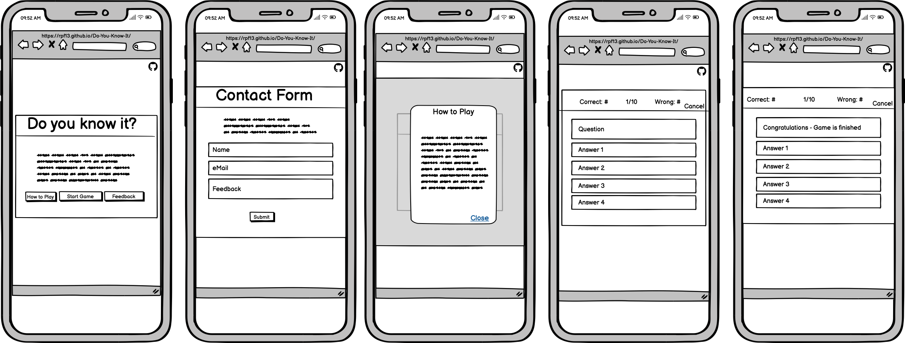

# Do You Know It?
The main purpose of this site is to provide a sleek and beautiful playground for the famous Trivia Quiz. It is a simple game, covering a few topics of the [Open Trivia Database](https://opentdb.com/).
The important goal is to have fun and get challenged by the questions.
    
Link to deployed site: [Do You Know It?](https://rpf13.github.io/Do-You-Know-It/)

    todo: Am I responive pic
---

## Objectives
This section covers the goals, which I had when doing this project. Not everything is clear form the beginning and it is difficult to estimate the technical effort, since I am new to this field. Therefore, the aim is the MVP with it's main functionality and put all other nice to have features into stretch objective.

### Main Objectives

My main objectives for this project (besides the below listed features) were, to get hands on JavaScript interaction with the DOM, but also to get more familiar with the basics of JS as well as trying to challenge myself to use some more advanced JS featues (like using the opentdb api).
I did also want to get more experiense with flexbox and trying to use css grid, get to know modals.

- Using advanced color scheme with multiple colors
- Main site which uses flexbox / grid to arrange cards, buttons, nav
- API call ot opentdb to get questions
- Implement 3 question topics with 3 difficulty levels and the choice of 10, 20 or 30 questions
- Button to explain game using modals
- Start button
- Feedback button, which "scrolls" user down on index.html to contact form
- Contact form with name, mail and feedback text. Submit button should trigger modal box with confirmation message and button to go back home
- Game section using the same color scheme
- Game section uses flexbox to display the question and all 4 possible answers
- Submit button will trigger either correct or wrong answer box. Wrong answer box also shows the correct answer
- Question progress as well as correct / wrong counter i shown
- Cancel button brings user back to home
- Social media buttons are on all sites
- Sites are built mobile first and scale up for bigger screens

### Stretch Objectives

The following stretch objectivse are meant as a "nice to have" feature and depending on the time, I will implement them or not.

- Cards on main site flip around after selecting them, showing a related emoji
- Game shows some "effects" once the user finishes like confetti rain, firework
- Correct and wrong answer count are realised via emoji (for the text)
- Timer countdown to answer

## UX & Design
The main design is based on a colorful, sleek design. It is minimalistic but it contains all necessary elements to have fun.

This site has been built with the "mobile first" approach in mind. This results in a very responsive and easy to navigate site, independet of the medium, which is used to access it.

### User Stories
- As a visiting user, I would like to be immediately attracted by beautiful, colorful and minimalistic site
- As a visiting user, I would like to have an immediate overview of the site and how the game works
- As a visiting user, I can find an explanation on how to play the game
- As a visiting user, I can choose from different topics, on which the questions will be displayed
- As a visiting user, I can choose the difficulty level as well as the amount of questions
- As a visiting user, I can see the status of the running game, how many questions are left, how many correct and wrong answers
- As a visiting user, I always have the chance to abort the game and go back to the main site
- As a visiting user, I can fill out a contact form to give feedback
- As a visiting user, I can visit social media sites via integrated links
- As a visiting user, I will get a feedback displaying the results, once I have finished all questions.


### Color Scheme
Therer are two different sets of colors. One set is used to create the various gradient effects, which result in the distinct and very beautiful background effect of every site and most of the cards. I did play with the degree of mixing the colors in order to achieve the result of different effects. The base of the gradient effect are three colors, which are then mixed together.

<details>
<summary>Gradient Base Colors and Gradient Mix</summary>

 


</details>

For the rest of site, I used the following colors, which are simple but build a nice and clear contrast to the gradient color palette.

<details>
<summary>Generic Colors</summary>


</details>

I have used [Coolors](https://coolors.co) to pick and compare the various colors.


### Typography
I used [Google Fonts](https://fonts.google.com/) to import "Roboto" as my main font, where as "sans-serif" acts as a backup font. For headings and special titles I used the font "Permanent Marker" with a backup of cursive.

<details>
<summary>Roboto Font</summary>


</details>

<details>
<summary>Permanent Marker Font</summary>


</details>

### Wireframes
As a first step of this project, before any code has been written, I have created Wireframes for Mobile and Desktop version. I have used Balsamiq to create them.

<details>
<summary>Mobile Wireframe</summary>



</details>

<details>
<summary>Desktop Wireframe</summary>


</details>

## Features
    briefly explain the project

### Existing Features
    list out all of your project's features, and make sure to include a screenshot of each!!

### Features Left to Implement
    have ideas on what you'd like to add in the future? add them here!! assessors LOVE seeing future concepts!

---

## Technologies Used
I used the following technologies and resources to create this site:

- [HTML5](https://www.w3.org/standards/webdesign/htmlcss)
    - HTML5 has been used to build the structure of the site
- [CSS3](https://www.w3.org/standards/webdesign/htmlcss)
    - CSS3 has been used for the styling of the site
- [Balsamiq](https://balsamiq.com)
    - Balsamiq has been used to create the Wireframes
- [Google Fonts](https://fonts.google.com)
    - Google Fonts has been used to choose and import the Fonts
- [Coolors](https://coolors.co)
    - Coolors has been used to create a color scheme
- [Tinywow](https://tinywow.com)
    - Tinywow has been used to compress and reformat the images
- [Git](https://git-scm.com)
    - Git has been used as the CLI version control tool
- [Github](https://github.com)
    - Github has been used to store the code and publish the site via Github Pages
- [Gitpod](https://gitpod.io/)
    - Gitpod has been used as the local IDE environment
- [Am I responsive?](https://ui.dev/amiresponsive)
    - Am I responsive has been used to show an image of the site on various devices
- [Webaim](https://webaim.org/resources/contrastchecker/)
    - WebAim has been used to check the contrast
- [Wave](https://wave.webaim.org)
    - Wave has been used to test the accessibility
- [MindNode](https://www.mindnode.com)
    - MindNode has been used to create the JS MindMaps

---

## Development

The following arguments describe *why and how* I have choosen to code certain parts the way they are. This section should give an explanation to my thinking process and explain the reader some conceptual decisions.

### Mobile First Approach
The site has been built in a mobile first approach. The goal was to not have to use any media queries but build a fully responsive site. This is achieved with various dynamic settings and flexbox.

### Challenges during Development

I faced a big challenge during the initial phase, when creating the html/css part of the main site. The initial goal was to build 9 square boxes, wich are inside a container and are evenly aligned using CSS grid. However, My ideas and my current knowledge of css grid, did not seem to be enough, because it did not work the way I wanted.

Since I did not have unlimited time to create this project, I have decided to stop and adjust the scope, living the agile development paradigm. I did brainstorm for alternate solutions and found a design, which I liked.

I quickly came up with another solution, using Flexbox, which I have already studied quite a lot during my first portfolio project. With this, I did a refactoring of the whole structure and ended up with a beautiful, simple and clean but completely responsive layout. I am very happy with the result.

### JavaScript

In order to attack the JavaScript part, I have started with brainstorming about the functions needed in the game. I wanted to have a clear plan, or at least an estimate about the logic to be built. I have created and constantly updated a Mind Map to visually display the logic. It also shows the connection between the functions, which is calling which. Furthermore, some key elements / task in each function are added to explain the purpose better.


### Commit messages

- I have decided to mostly use multiline commit messages. Commit messages are an essential part of the whole project and a single line commit message is just not enough to explain. After reading [this interesting article](https://cbea.ms/git-commit/), it was clear to me, that I have to use it.

- I have decided to use conventional commits, as described this [cheatsheet](https://cbea.ms/git-commit/) or as also described in the LMS of the Code Institute. I did use the following syntax guidline:
    * **feat:** for feature which may or may not include a CSS part
	* **fix:** for a bugfix
	* **style:** for changes to CSS or to give style to the code itself
	* **docs:** for changes related to documentation
	* **refactor:** for refactored code, re-written code
	* **maint:** for general maintenance

---

## Testing
Testing is covered in a separate page, view [testing.md](TESTING.md)

## Deployment

The site was deployed to GitHub pages. The steps to deploy are as follows:
  - In the [GitHub repository](https://github.com/rpf13/Do-You-Know-It), navigate to the Settings tab
  - In the Code and automation section, click on pages
  - From the branch section drop-down menu, select the Main Branch
  - Then click save. After a few minutes you can see that the page is deployed and live, showing the related link.

The live link can be found here [Do You Know It?](https://rpf13.github.io/Do-You-Know-It/)

### Local Deployment
If you want to make your own copy of this project and work on it, you can clone it locally to your IDE of choice.
Inside the terminal of your IDE, use the following command:
```
git clone git@github.com:rpf13/Do-You-Know-It.git
```

If you are using your IDE inside Gitpod or generally prefer to work with Gitpod instead of a local IDE, you can open
this project directly in Gitpod and and create your own workspace with it. To do so, klick on the following link:

[](https://gitpod.io/#https://github.com/rpf13/Do-You-Know-It)

Please note that in order to directly open the project in Gitpod, you need to have the browser extensions (Chrome, Firefox) installed. A tutorial on how to do that can be found [here](https://www.gitpod.io/docs/configure/user-settings/browser-extension).

---

## Credits
    explain about any particular places you took inspiration from

### Content
    list out any URLs or links where you might've borrowed a snippet of code, or element

### Media
    list out any URLs for images/videos/audios you've borrowed from online (Markdown Table works best here!)

### Acknowledgements
    list out any acknowledgements you have, if any... tutor support? fellow Slack student help? spouse, loved one, family member, etc.