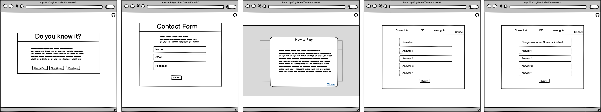

# Do You Know It?
The main purpose of this site is to provide a sleek and beautiful playground for the famous Trivia Quiz. It is a simple game, covering a few topics of the [Open Trivia Database](https://opentdb.com/).
The important goal is to have fun and get challenged by the questions.
    
Link to deployed site: [Do You Know It?](https://rpf13.github.io/Do-You-Know-It/)

    todo: Am I responive pic
---

## Objectives
This section covers the goals, which I had when doing this project. Not everything is clear form the beginning and it is difficult to estimate the technical effort, since I am new to this field. Therefore, the aim is the MVP with it's main functionality and put all other nice to have features into stretch objective.

### Main Objectives

My main objectives for this project (besides the below listed features) were, to get hands on JavaScript interaction with the DOM, but also to get more familiar with the basics of JS as well as trying to challenge myself to use some more advanced JS featues (like using the opentdb api).
I did also want to get more experiense with flexbox and trying to use css grid, get to know modals.

- Using advanced color scheme with multiple colors
- Main site which uses flexbox / grid to arrange cards, buttons, nav
- API call ot opentdb to get questions
- Implement 3 question topics with 3 difficulty levels and the choice of 10, 20 or 30 questions
- Button to explain game using modals
- Start button
- Feedback button, which "scrolls" user down on index.html to contact form
- Contact form with name, mail and feedback text. Submit button should trigger modal box with confirmation message and button to go back home
- Game section using the same color scheme
- Game section uses flexbox to display the question and all 4 possible answers
- Submit button will trigger either correct or wrong answer box. Wrong answer box also shows the correct answer
- Question progress as well as correct / wrong counter i shown
- Cancel button brings user back to home
- Social media buttons are on all sites
- Sites are built mobile first and scale up for bigger screens

### Stretch Objectives

The following stretch objectivse are meant as a "nice to have" feature and depending on the time, I will implement them or not.

- Cards on main site flip around after selecting them, showing a related emoji
- Game shows some "effects" once the user finishes like confetti rain, firework
- Correct and wrong answer count are realised via emoji (for the text)
- Timer countdown to answer

## UX & Design
The main design is based on a colorful, sleek design. It is minimalistic but it contains all necessary elements to have fun.

This site has been built with the "mobile first" approach in mind. This results in a very responsive and easy to navigate site, independet of the medium, which is used to access it.

### User Stories
- As a visiting user, I would like to be immediately attracted by beautiful, colorful and minimalistic site
- As a visiting user, I would like to have an immediate overview of the site and how the game works
- As a visiting user, I can find an explanation on how to play the game
- As a visiting user, I can choose from different topics, on which the questions will be displayed
- As a visiting user, I can choose the difficulty level as well as the amount of questions
- As a visiting user, I can see the status of the running game, how many questions are left, how many correct and wrong answers
- As a visiting user, I always have the chance to abort the game and go back to the main site
- As a visiting user, I can fill out a contact form to give feedback
- As a visiting user, I can visit social media sites via integrated links
- As a visiting user, I will get a feedback displaying the results, once I have finished all questions.

### Colour Scheme
    explain your colors, etc.... perhaps use coolors.co? to generate an image palette

### Typography
I used [Google Fonts](https://fonts.google.com/) to import "Roboto" as my main font, where as "sans-serif" acts as a backup font.

### Wireframes
As a first step of this project, before any code has been written, I have created Wireframes for Mobile and Desktop version. I have used Balsamiq to create them.

Mobile Wireframe

Desktop Wireframe

## Features
    briefly explain the project

### Existing Features
    list out all of your project's features, and make sure to include a screenshot of each!!

### Features Left to Implement
    have ideas on what you'd like to add in the future? add them here!! assessors LOVE seeing future concepts!

## Technologies Used
    explain various tech used, such as HTML, CSS, Gitpod, GitHub, Git, etc. - add a link to each respective site as well, if possible

## Testing
    "For all testing, please refer to the [TESTING.md](TESTING.md) file."

## Deployment
    document all necessary steps you did in order to deploy this project (GitHub Pages, Heroku, etc.)

### Local Deployment
    document all the necessary steps someone else can take in order to make a local copy of your project, like cloning, forking, etc.

## Credits
    explain about any particular places you took inspiration from

### Content
    list out any URLs or links where you might've borrowed a snippet of code, or element

### Media
    list out any URLs for images/videos/audios you've borrowed from online (Markdown Table works best here!)

### Acknowledgements
    list out any acknowledgements you have, if any... tutor support? fellow Slack student help? spouse, loved one, family member, etc.