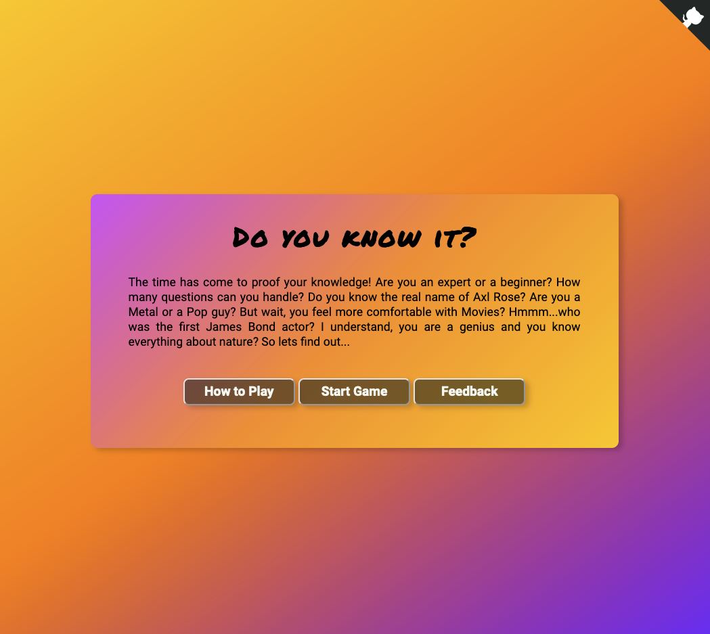
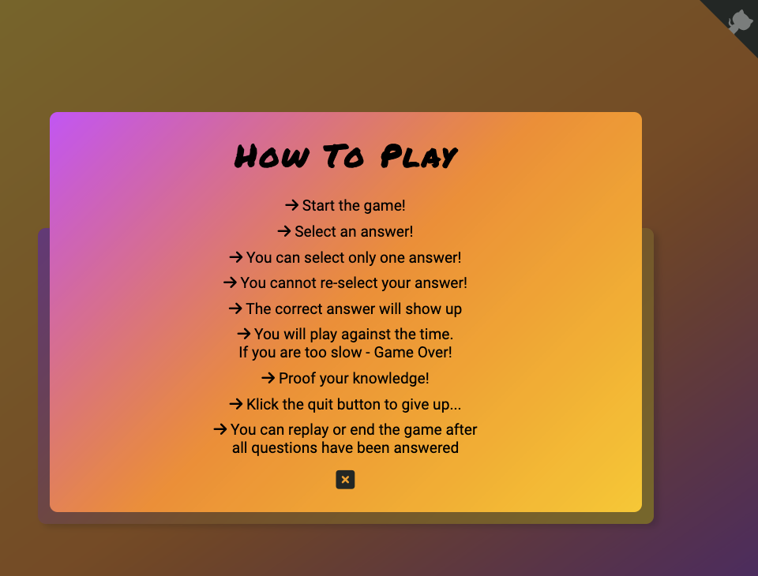
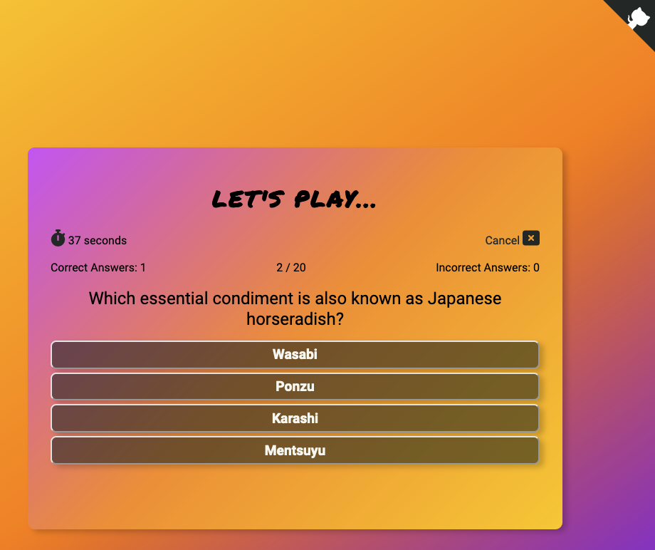
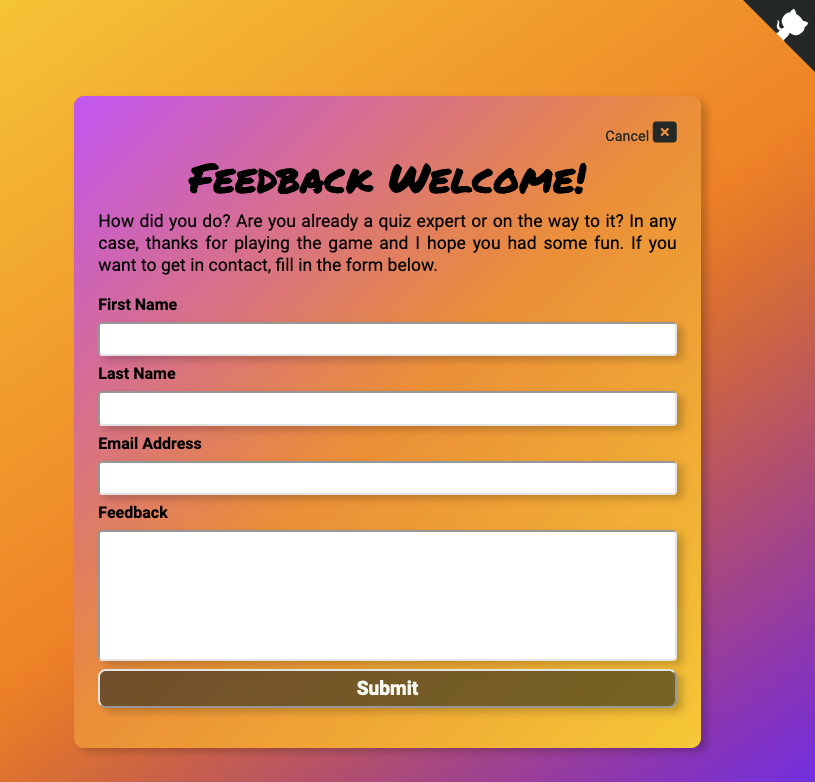
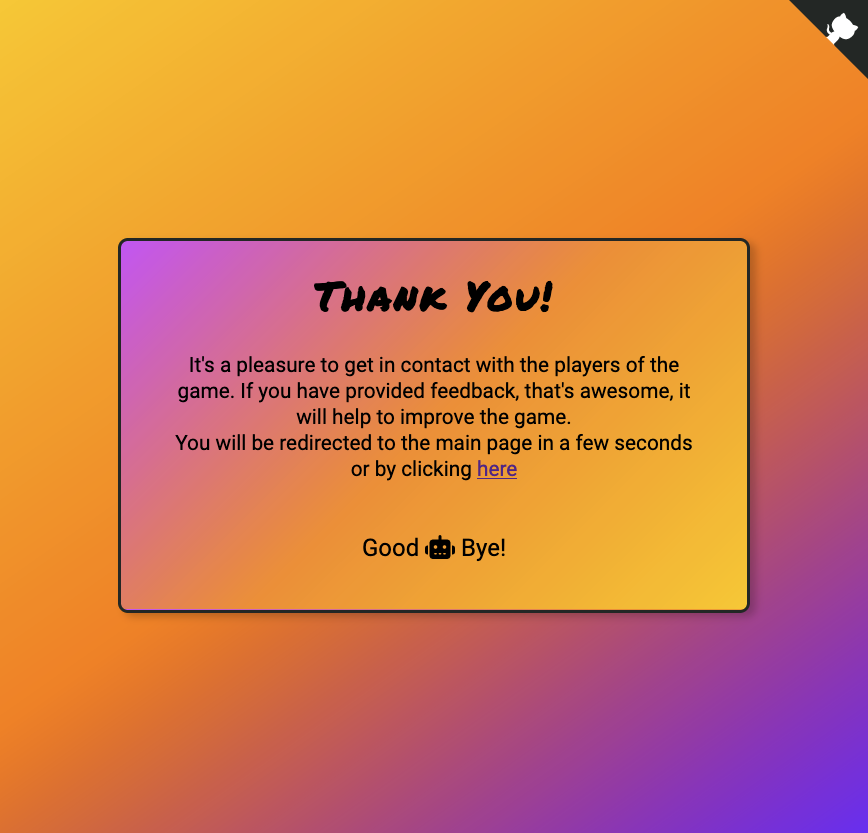
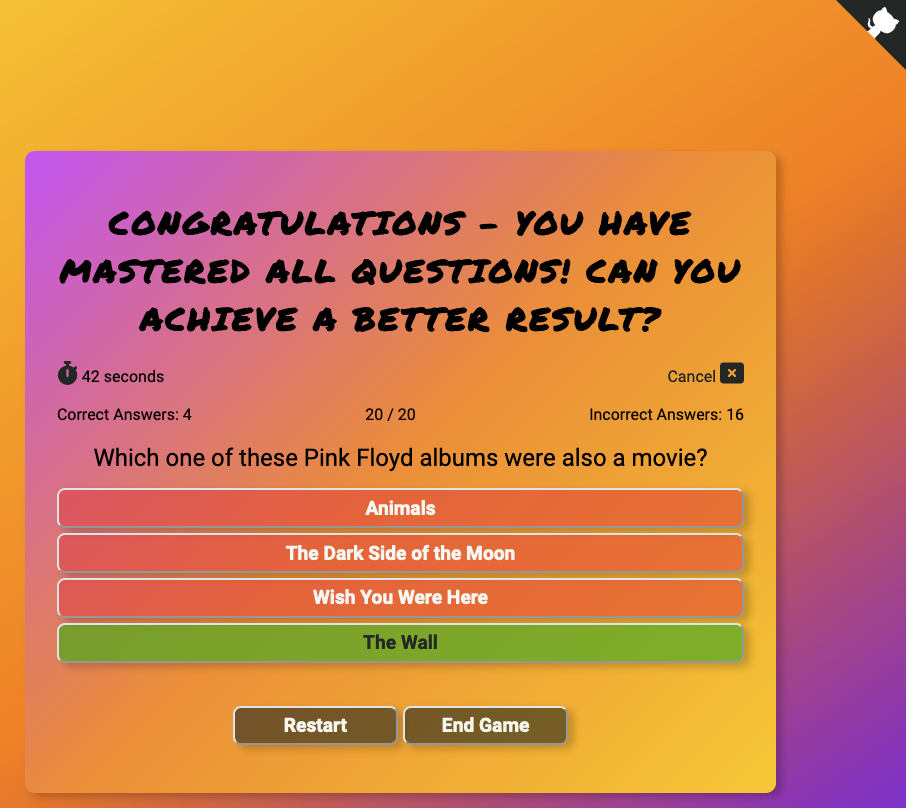

# Testing

This site conains all testing, executed for this project.

"Click to return back to the [README.md](README.md)"

---
## User Stories Testing

- As a visiting user, I would like to be immediately attracted by a beautiful, colorful and minimalistic site

    

- As a visiting user, I can find an explanation on how to play the quiz

    

- As a visiting user, I would like to have an immediate overview of the site and how the quiz works
    -> Fullfilled via the simple and self-explanatory interface
- As a visiting user, I can see the status of the running quiz, how many questions are left, how many correct and wrong answers
    -> Fullfilled via the quiz status bar, showing correct-, incorrect questions amount as well as at which, out of how many questions, the player is currently at.
- As a visiting user, I always have the chance to abort the game and go back to the main site
    -> Fullfilled via the Cancel button on the top right of the quiz card.

    

- As a visiting user, I can fill out a contact form to give feedback

    

- As a visiting user, I can visit the github repo via dedicated link / button
    -> Github repo "top right corner button" available on each site, on every card displayed.

    

- As a visiting user, I will get an end of game text, once I have finished all questions. From there I can replay the game or go back to the main site.

    

---
## Code Validation
    you must showcase proof with screenshots that you've validated any code files, such as HTML, CSS, JS, Python (where applicable)

### HTML Validator

### CSS Validator

### Java Script Validator

### Performace Testing via Lighthouse

### Wave Webaim Validator

## Responsiveness
    you must showcase proof with screenshots that you've tested the finished project on different device sizes, such as mobile, tablet, desktop.

- iPhone

- iPad

- Desktop
---
## Browser Compatibility
    you must showcase proof with screenshots that you've tested the finished project on various browsers, such as Chrome, Firefox, Edge, Safari, Brave, etc.
    -> Add table with all browsers, tested

## Unfixed Bugs
    list out any unfinished bugs you might have, where applicable... if none, don't just put "I have no bugs"... put something like: "There are no remaining bugs that I am aware of."
