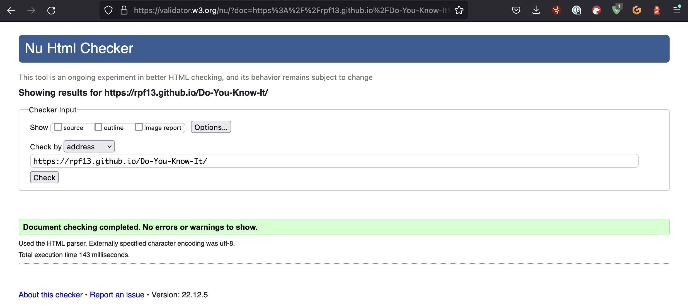
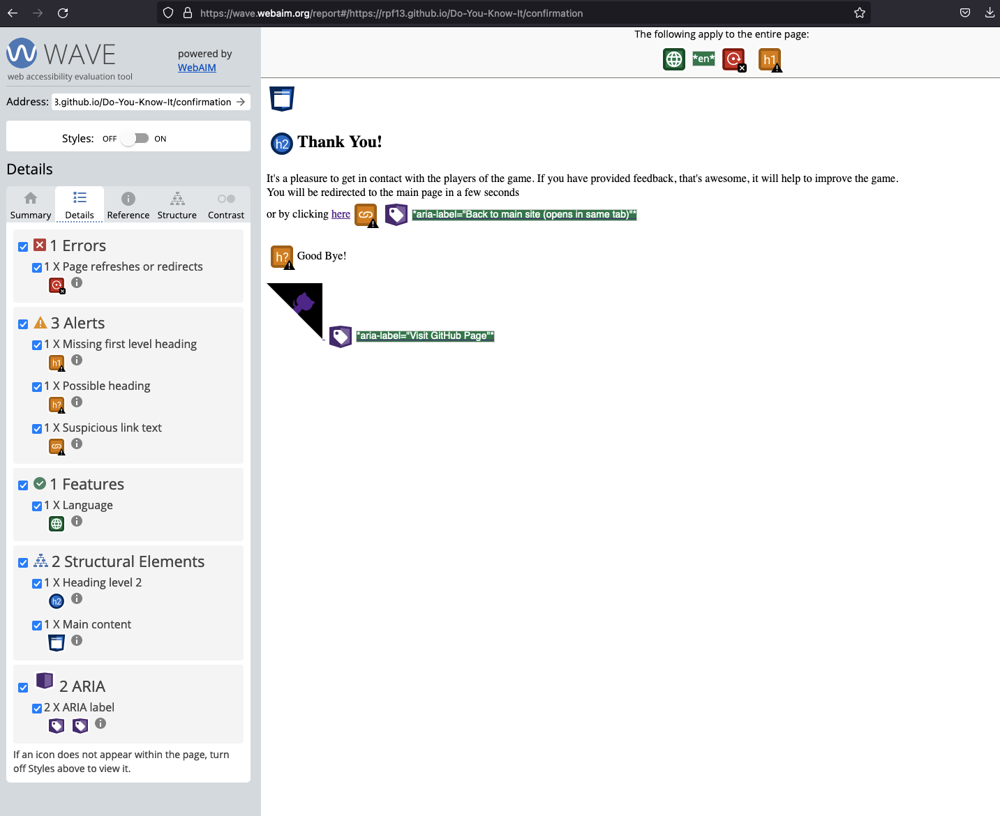

# Testing

This site conains all testing, executed for this project.

"Click to return back to the [README.md](README.md)"

---
## User Stories Testing

- As a visiting user, I would like to be immediately attracted by a beautiful, colorful and minimalistic site

    

- As a visiting user, I can find an explanation on how to play the quiz

    

- As a visiting user, I would like to have an immediate overview of the site and how the quiz works
    -> Fullfilled via the simple and self-explanatory interface
- As a visiting user, I can see the status of the running quiz, how many questions are left, how many correct and wrong answers
    -> Fullfilled via the quiz status bar, showing correct-, incorrect questions amount as well as at which, out of how many questions, the player is currently at.
- As a visiting user, I always have the chance to abort the game and go back to the main site
    -> Fullfilled via the Cancel button on the top right of the quiz card.

    

- As a visiting user, I can fill out a contact form to give feedback

    

- As a visiting user, I can visit the github repo via dedicated link / button
    -> Github repo "top right corner button" available on each site, on every card displayed.

    

- As a visiting user, I will get an end of game text, once I have finished all questions. From there I can replay the game or go back to the main site.

    

---
## Code Validation
Great care has been taken for the code validation testing. A wide range of test's have been executed, as shown in the next chapters.

### HTML Validator
Test run via the official [w3c html validator](https://validator.w3.org/#validate_by_uri)

- Main Site did not show any errors, after fixing the [mentioned](#fixed-bugs) point. The other two warnings shown on this snapshot are not considered to be an issue because in my Layout, they really server as H1 headings.

    

- Confirmation Site did not show any errors or warnings.

    

### CSS Validator

Test run via the official [w3c css validator](https://jigsaw.w3.org/css-validator/)

- Main site did not show any errors

    

- Confirmation site did not show any errors

    

### Java Script Validator
The JavaScript code has been tested with the [jshint](https://jshint.com/) JavaScript tester. Both JS files have been checked, the main scripts.js file as well as the questions.js file. No significant / problematic errors have been reported.

- jshint for scripts.js file
    

- jshint for questions.js file
    

### Performace Testing via Lighthouse
Performance Testing has been done via Lighthouse extension on the Chrome browser. I have testes for desktop and mobile and I am very happy with the result:

- Desktop
    

- Mobile

    

### Wave Webaim Validator
I did run the [Wave Webaim Validator](https://wave.webaim.org/) validator on both sites. 

- Main site did not show any critical error
    

- Confirmation site did not show any critical errors except the automatic redirect back to the main site, of the confirmation page. Since this behavior is mentioned in the text displayed, when the user accesses this site, I don't consider it as a critical error.

    

## Functional testing & Responsiveness
The functional and responsiveness testing will be shown in a combined manner. All functions of the site will be tested with each device stated below, showing that responsiveness is granted and proper functionality is documented with each device type.
If there are multiple steps possible per section, only one snapshot will be provided in order to proff the responsiveness. All functionality, as mentioned in each section is tested on each of the devices. If nothing special is mentioned, functionality was tested without an error.

- iPhone

iPhone 12 Pro iOS 16.1 tested with Safari

- Main Game Site

    

- How to Play Button to modal w. explanation where as click on close or outside the modal closes the modal box.

    

- Feedback card filling in form
    - missing one of the mandatory fields & getting an error
    - click on cancel button to leave
    - filling out complete form and submit
    - confirmation site w. redirect back to main site after a few seconds

    

    

    

- Main quiz functionality (Start Game button)
    - Question & Answers get displayed
    - Countdown Timer starts running
    - Selecting answer disables answer button click functionality
    - Selecting answer displays correct, incorrect answers via green or red color
    - Correct or incorrect answers counter increases by 1
    - Next Question button displays next question
    - If time elapses, game over message appears, answer button click functionality gets disabled
    - Replay button starts a new game, all counters reset
    - End Game button brings the user back to main site
    - Finishing quiz shows end of quiz message, statistics as well as Restart and End Game button

    

    

    

    

    

- iPad

iPad Pro 11" iOS 16.1 tested with Chrome for iPad OS

- Main Game Site

    

- How to Play Button to modal w. explanation where as click on close or outside the modal closes the modal box.

    

- Feedback card filling in form
    - missing one of the mandatory fields & getting an error
    - click on cancel button to leave
    - filling out complete form and submit
    - confirmation site w. redirect back to main site after a few seconds

    

    

    

- Main quiz functionality (Start Game button)
    - Question & Answers get displayed
    - Countdown Timer starts running
    - Selecting answer disables answer button click functionality
    - Selecting answer displays correct, incorrect answers via green or red color
    - Correct or incorrect answers counter increases by 1
    - Next Question button displays next question
    - If time elapses, game over message appears, answer button click functionality gets disabled
    - Replay button starts a new game, all counters reset
    - End Game button brings the user back to main site
    - Finishing quiz shows end of quiz message, statistics as well as Restart and End Game button

    

    

    

    

    

- Desktop

Macbook Pro 16" tested with Firefox v106.05

- Main Game Site

    

- How to Play Button to modal w. explanation where as click on close or outside the modal closes the modal box.

    

- Feedback card filling in form
    - missing one of the mandatory fields & getting an error
    - click on cancel button to leave
    - filling out complete form and submit
    - confirmation site w. redirect back to main site after a few seconds

    

    

    

- Main quiz functionality (Start Game button)
    - Question & Answers get displayed
    - Countdown Timer starts running
    - Selecting answer disables answer button click functionality
    - Selecting answer displays correct, incorrect answers via green or red color
    - Correct or incorrect answers counter increases by 1
    - Next Question button displays next question
    - If time elapses, game over message appears, answer button click functionality gets disabled
    - Replay button starts a new game, all counters reset
    - End Game button brings the user back to main site
    - Finishing quiz shows end of quiz message, statistics as well as Restart and End Game button

    

    

    

    

    

---
## Browser Compatibility
In addition to the various browsers used on the many different devices, mentioned in all the tests, I have made additional tests on many more devices. The following table will give an overview of all combinations, where the site has been tested. Most test's have been done by me, but due to the fact, that I do not own all sorts of devices, some tests have been executed by family and colleagues on my dayjob.

For all the devices and browsers, the same kind of functional testing has been done as shown in the chapter [Functional and Responsiveness Testing](#functional-testing--responsiveness)

|                             | Chrome | Firefox | Safari | Edge |
|-----------------------------|:------:|:-------:|:------:|:----:|
| OS X 12.6.1 MacBook Pro 16" |  PASS  |   PASS  |  PASS  | N.A. |
| iOS 16.1.1 iPhone 12 Pro    |  PASS  |   PASS  |  PASS  | N.A. |
| iPadOS 16.1.1 iPad Pro 11"  |  PASS  |   PASS  |  PASS  | N.A. |
| Windows 10 Pro 21H1         |  PASS  |   PASS  |  N.A.  | PASS |
| Android 11 Sony Xperia 5    |  PASS  |   N.A.  |  N.A.  | N.A. |
| Android 13 OnePlus          |  PASS  |   N.A.  |  N.A.  | N.A. |
| Linux Ubuntu 20.04LTS       |  N.A.  |   PASS  |  N.A.  | N.A. |

---
## Bugs

### Fixed Bugs

- **How To Modal Box:**  By accident I have used the p tag instead of the a tag for the close button. After changing the tag, the error was fixed. The other two warnings shown on this snapshot are telling the error I did with having more than one h1 heading per site, which is a semantic error. I did correct them to h2 heading, leaving only one h1.

    

### Unfixed Bugs
My personal, very extensive testing and the one of my family and working colleagues did not show any bugs left, at least not to my knowledge.

### Known Issues
On very small screen sizes, smaller than 200px, the content starts to overflow. This is known, but I did not consider this small screen size as realistic to play the quiz. I mean, it would not be fun to play the quiz for example on a Smartwatch. Therefore I do not consider this as a problem.

---

